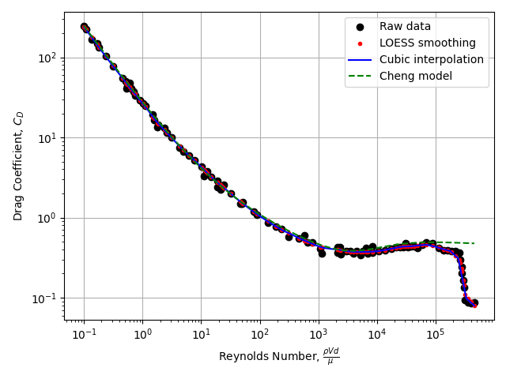

# Introduction

Whats up slingshot people!

I bought my first slingshot (Scout LT) a couple weeks ago, and whatever I lack in slingshot skill I can make up for in modeling ability.  So while I still can't build a catch box big enough to catch my stray shots, I can tell you very precisely where those shots would end up or how I should have fired them in order to have a direct hit.

I saw [this video on YouTube](https://www.youtube.com/watch?v=IyuJEdPcXYI) where Fowler hit a 6" target from 100 yards in about 20 shots.  I've also seen Chinese style slingshots with adjustable "sights" that supposedly help hit targets at range.  This all got me asking: what is the maximum effective range of a slingshot, and what are the factors (human, equipment, or environmental) that limit it?

So for my first posts on the forum, I am going to focus on *slingshot ballistics* where I'll calculate all kinds of things about how slingshot ammo flies through the air.  Because there is a lot to talk about, I am going to break this up into a series of posts:

1. Introduction and methodology (this post)
2. Maximum ranges of various slingshot ammo and sighting tables
3. How steady does your arm need to be?
4. Energy loss from drag and the maximum effective hunting range
5. Wind, temperature, and air pressure effects

I have no idea if this is interesting to any of you.  I am just some nerd that's nerding out about slingshots.  But if it is interesting or useful, give me some feedback.  I've written some good code for this, and it's probably easy for me to look into other ammo types, environmental conditions, and other scenarios than the ones I cover here.

The code is publicly available on Github.  [Follow the repo here](https://github.com/truemerrill/slingshot) and I'll keep it up to date as I add new features.  If you can code Python I am open to contributions.  Just fork and pull request.

# Methodology

Slingshot ballistics is very similar to the physics you learned in high school.  Ammo moves in a parabolic arc that starts at the firing position and ends at the impact point.  We are going to be slightly more sophisticated than high-school physics by including air resistance.  As ammo travels through the air it "drags" the air behind it, creating eddy currents.  Because it takes energy to move the air, this energy comes from the kinetic energy of the ammunition.  As a result, your shot slows down as it flies through the air.  From the shooter's perspective, the ammo drops faster towards the end of it's flight.  These effects are *super important* for long range shots.

Alright, this next section is probably the most technical of everything I am going to cover in this series.  I am putting it here so that the people who know this stuff can check my work, but you don't really need to understand it in order to understand what follows.  The take away is I was very careful to calculate drag forces accurately.

For those in the know, this is what I did:

* I am only considering smooth, spherical ammunition.
* The drag force on the ammunition is modeled with the [drag equation](https://en.wikipedia.org/wiki/Drag_equation).  The reference area is the cross-section of the sphere.
* The mass-density of air calculated using the ideal gas law.  This lets me consider effects that change the density of air, such as shooting on a cold day or shooting at high altitude where the air is thinner.
* The mass of the ammunition is calculated from the ammunition diameter and material density (steel, lead, clay, etc.).
* The drag coefficient is tricky to model (more on that below).
* I solved the ODE for F = ma numerically using the RK45 algorithm.  The solver I am using lets me hone in on specific points in the trajectory, such as the exact moment when the ammunition passes through a paper target.

## The drag coefficient

I promise, this is the only fluid mechanics.  The drag coefficient is actually not a constant, and actually depends on the speed of ammunition relative to the air (the flow speed).  More precisely, the drag coefficient is a function of the [Reynolds number](https://en.wikipedia.org/wiki/Reynolds_number).  If you've never heard of the Reynolds number, just know it's proportional to the flow speed and it allows us to model the flow regardless of the fluid viscosity.  Flow through air and oil are modeled with the same sets of equations, but you might have a different Reynolds number describing the flow.

The graph below plots the drag coefficient of a smooth sphere versus the Reynolds number.

* The black points are experimental data that I extracted from a plot from [Munson, Young, and Okiishi "Fundamentals of Fluid Mechanics", Wiley, 1990](https://www.wiley.com/en-us/Munson%2C+Young+and+Okiishi's+Fundamentals+of+Fluid+Mechanics%2C+8th+Edition-p-9781119547990).
* I smoothed the logarithms of the experimental data using Locally Weighted Scatterplot Smoothing (Lowess).  I then converted the smoothed logarithms back to linear space.  These points are plotted in red.
* I use cubic interpolation to interpolate between smoothed points.  The interpolated curve is in blue.
* Later, I found a good empirical approximation by Cheng that fit the experimental data all the way to the [drag crisis](https://en.wikipedia.org/wiki/Drag_crisis) which occurs above Re ~ 1e5.  The Cheng model is plotted in green.

Since all of the slingshot problems I've seen so far operate below the drag crisis, I just use the Cheng model in most of my calculations.  It tends to be more numerically stable and gives effectively the same results as the interpolated model.

# TL;DR

* I am new here.  I am a terrible shot, but I'm good at math.
* I am writing a series of posts about how slingshot ammo flies through the air.
* Feedback welcome.  Tell me what you want me to calculate.